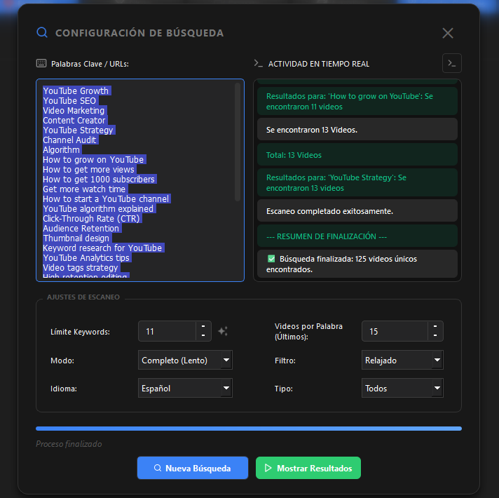
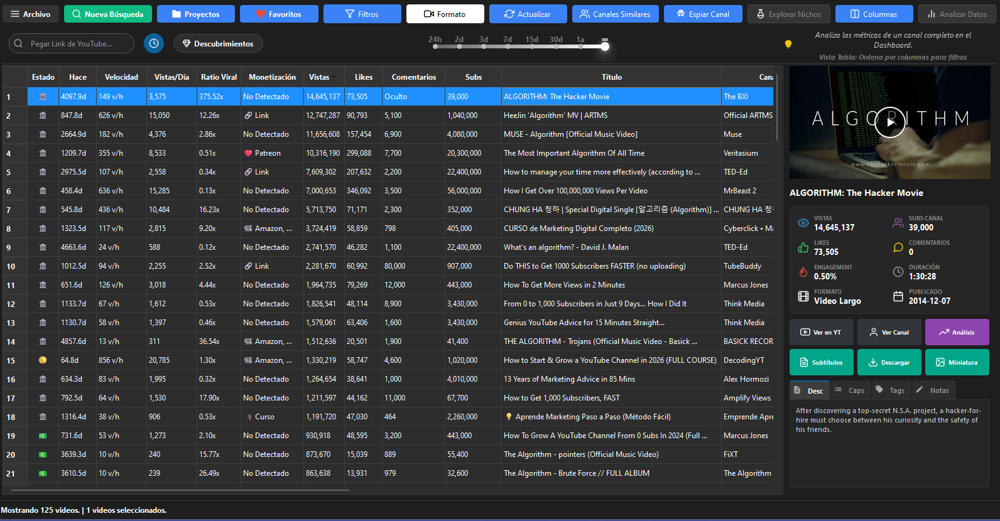
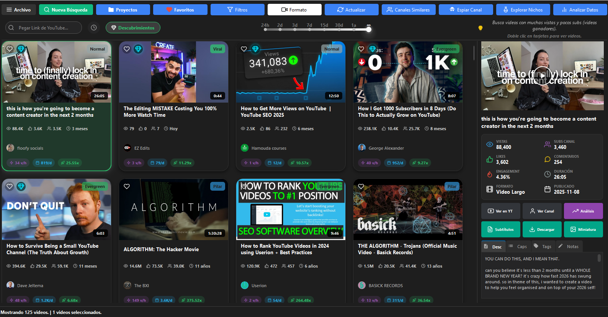
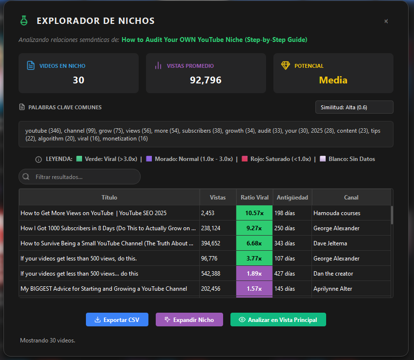
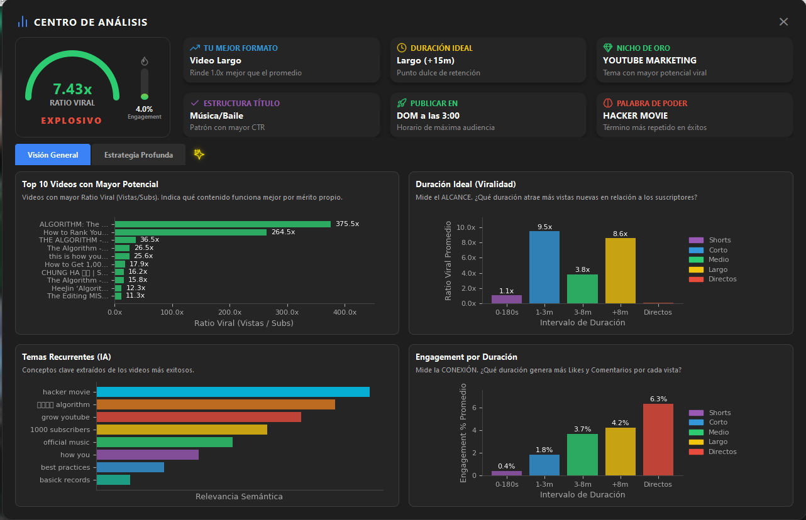
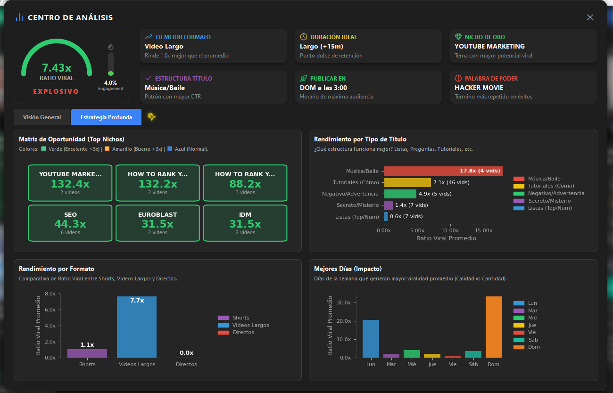
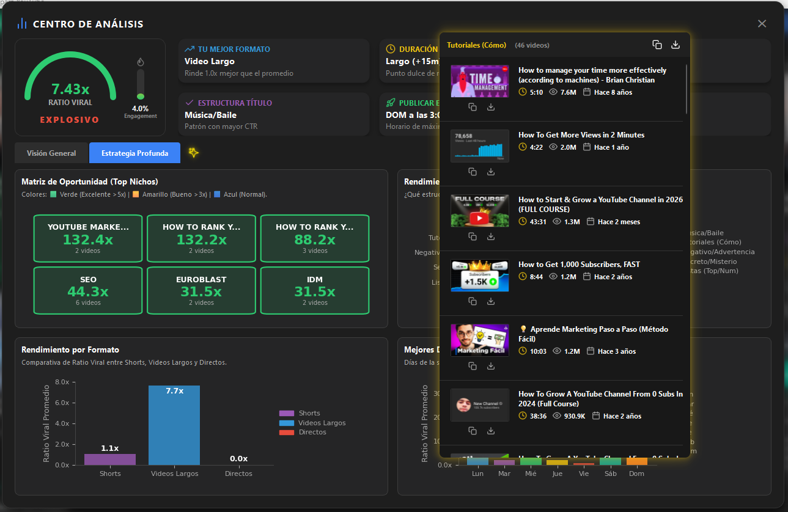

# Automated YouTube Data Extraction & NLP Analysis Suite

> **Note:** The source code for this repository is currently closed-source as it is part of an active proprietary toolset. This README serves as a technical showcase of the software's architecture, data pipelines, and engineering solutions.

## Overview

  

  

  

  

  

  

  

A high-performance desktop application built with **Python** and **PyQt6**, designed for the large-scale extraction, processing, and semantic analysis of YouTube metadata. 

The system acts as a complete local pipeline: it handles concurrent web scraping, processes the unstructured data using local Natural Language Processing (NLP) models, and provides an interactive GUI for Exploratory Data Analysis. It was built to replace manual market research with automated, data-driven quantitative insights.

## Tech Stack & Libraries

* **Core:** Python 3.10+
* **GUI & Concurrency:** `PyQt6` (Custom widgets, non-blocking UI), `QThread`, `ThreadPoolExecutor`.
* **Data Extraction:** `yt-dlp` (Advanced wrapper with process management), `requests`, `subprocess`.
* **Data Processing & EDA:** `pandas`, `numpy`, `Matplotlib` (Integrated into Qt).
* **Machine Learning (NLP):** `KeyBERT`, `Sentence-Transformers`, `YAKE`, `TextBlob`.
* **Deployment:** `PyInstaller` for standalone distribution.

## System Architecture

The application follows a modular, event-driven architecture to ensure stability during intensive scraping tasks:

1.  **Presentation Layer (Frontend):**
    * Tab-based navigation system with dynamic data tables.
    * Interactive dashboards for channel and niche analysis natively integrated via Matplotlib.

2.  **Business Logic & Workers (Backend):**
    * **Scraping Engine:** Dedicated worker threads (`QThread`) manage `yt-dlp` subprocesses to extract metadata, transcripts, and real-time statistics without blocking the main event loop.
    * **NLP Processor:** Lazy-loaded NLP models (`importlib`) that perform semantic clustering and sentiment analysis, optimizing initial memory consumption.

3.  **Deployment & Environment Layer:**
    * **Hybrid Environment Management:** Context-aware path resolution handling both development (Python script) and production (PyInstaller frozen executable) environments seamlessly.
    * Intelligent local caching system for thumbnails and metadata to minimize API/bandwidth usage.

## Core Features

### 1. Concurrent Data Extraction Pipeline
Bulk extraction of video metadata based on complex queries or channel URLs. 
* Implements robust error handling strategies, including browser cookie injection for authentication and advanced rate-limit avoidance (HTTP 429/403).
* Handles pagination and concurrent threading gracefully while supporting specific filters (Shorts, VODs, Live Streams).

### 2. NLP-Based Semantic Clustering
Utilizes local language models (`Sentence-Transformers`) to calculate cosine similarity and find hidden relationships between videos. 
* Groups content by semantic similarity rather than exact keyword matches.
* Extracts core topics and sentiment from video transcripts using `KeyBERT` and `TextBlob`.

### 3. Exploratory Data Analysis (EDA) Dashboard
Built-in visualization tools for immediate quantitative analysis:
* **Outlier Detection:** Identifies videos that statistically deviate from a channel's standard performance baseline.
* **Temporal Heatmaps:** Visualizes historical publishing patterns and performance density.
* **Performance Metrics:** Calculates custom ratios (e.g., View-to-Subscriber velocity) to identify trending topics.

### 4. Reverse Engineering & Historical Archiving
Downloads and analyzes a competitor's entire historical dataset to reveal long-term content strategies, tag evolution, and retention metrics. Supports local media archiving (Video/Audio/Subtitles) for offline processing.

## Interface Showcase

Detailed screenshots demonstrating the application's dashboards, data tables, and NLP clustering interfaces can be found in the [`screenshots/`](./screenshots) directory.

## Technical Impact

* Built a non-blocking GUI that safely handles thousands of concurrent data points without freezing the main thread.
* Automated a complex data pipeline, reducing a multi-hour manual Exploratory Data Analysis process to a sub-minute script.
* Successfully integrated local deep learning modelsinto a distributable desktop environment for offline, privacy-first analysis..

*Developed by Rogger Efrain Paucar Oviedo*
